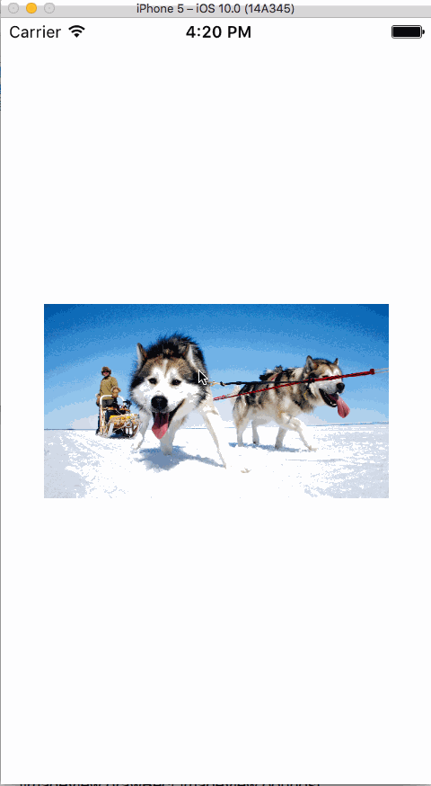

# NTImageBrowser
### 这是一个仿微信中点击头像放大图片的Demo，其中包含了该功能的工具类

* 使用方法

##### 1、导入"NTImageBrowser.h"和"NTImageBrowser.m"文件
需要做规划处理的话也可以将NTImageBrowser.m文件中的方法放到项目中定义好的工具类中
##### 2、直接使用类方法

```objc
// 传入的是UIImageView类型的对象
[NTImageBrowser showImageBrowserWithImageView:imageView];

```

* 效果展示


